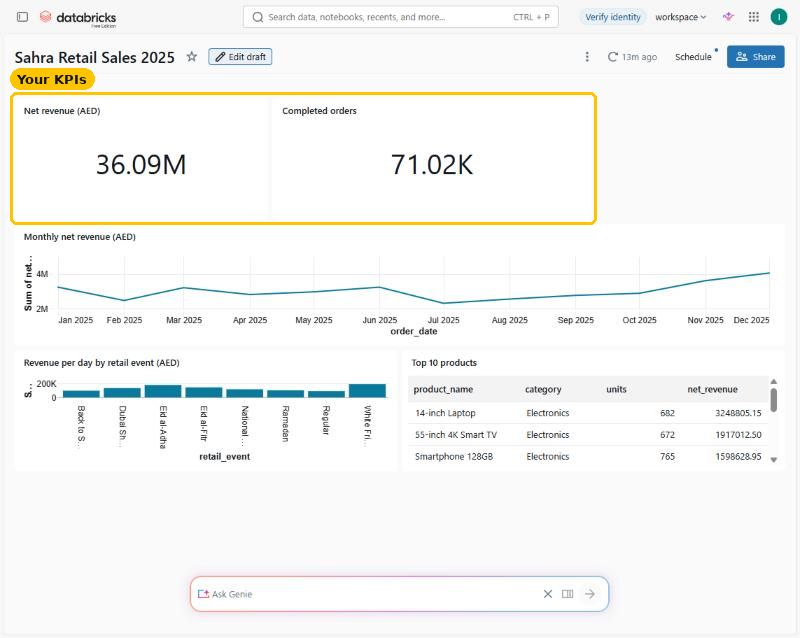
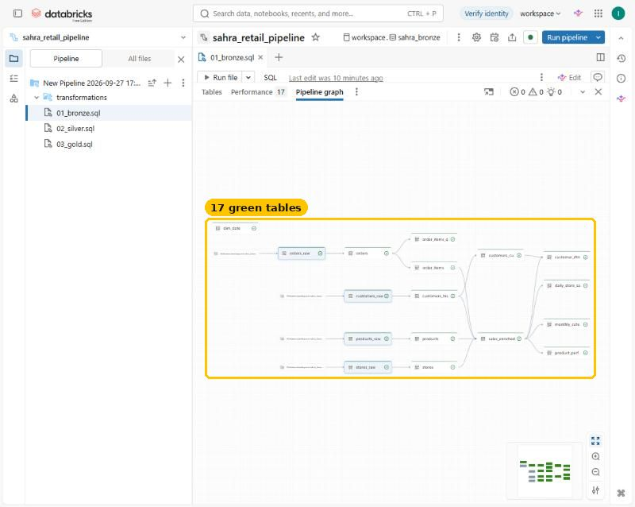

<p align="center">
  <br>
  <b>Sahra Retail Lakehouse</b><br>
  <sub>by <a href="https://www.linkedin.com/in/imranazhar/">Imran Sheikh</a> · Digital &amp; AI transformation leader · Abu Dhabi, UAE</sub>
</p>

<p align="center">
  <a href="https://YOUR-GITHUB-USERNAME.github.io/sahra-retail-lakehouse/"><b>📘 Open the step-by-step guide</b></a> ·
  <a href="https://www.linkedin.com/in/imranazhar/">Connect on LinkedIn</a><br>
  
  
  
  
</p>

# Sahra Retail Lakehouse

An end-to-end data engineering project on **Databricks Free Edition**: raw files → Bronze → Silver → Gold →
AI/BI dashboard → Genie, orchestrated as a scheduled Job. Everything runs for free.

**Sahra Retail** is a fictional UAE retail chain: 11 stores across the emirates plus an online store, 110 products in
6 categories, 3,100 loyalty customers and one year (2025) of about 78,000 orders. Sales follow the UAE retail calendar
(Ramadan, both Eids, White Friday, Dubai Shopping Festival). The raw data contains realistic mistakes on purpose,
so the pipeline has real cleaning to do.



## What this project shows
- **Bronze:** incremental ingestion with Auto Loader (`read_files`) into streaming tables, with file lineage.
- **Silver:** de-duplication, type fixes, two date formats, data-quality expectations with a quarantine table,
  and customer history as **SCD Type 2** with `AUTO CDC`.
- **Gold:** a wide sales fact, a calendar with UAE retail events, daily/monthly KPIs, product ranking and RFM segments.
- **Serving:** an AI/BI dashboard and a Genie space that answers questions in plain English.
- **Operations:** a daily Job (new data → pipeline refresh) with a schedule.



## What is in the box
```
data/                       raw files, ready to upload (seeded, reproducible)
  orders/                   12 monthly JSON Lines files, nested items, with deliberate quality issues
  customers/                3 CRM exports (Jan snapshot, Jul changes + sign-ups, Dec sign-ups)
  products/ stores/         master data (CSV)
generator/generate_data.py  the script that made the data (run locally: python generate_data.py)
notebooks/
  00_setup.py               schemas, landing volume, folders
  01_generate_data.py       (optional) create the data directly in the volume instead of uploading
  02_simulate_new_orders.py drop new daily files to see incremental processing and SCD2 in action
  03_explore_and_verify.sql checks for every layer + Delta time travel + governance lab
pipeline/                   Lakeflow Declarative Pipeline source (SQL)
  01_bronze.sql             streaming tables with Auto Loader (read_files)
  02_silver.sql             cleaning, de-duplication, expectations, quarantine, AUTO CDC SCD Type 2
  03_gold.sql               wide fact, calendar with UAE events, KPIs, product ranks, RFM segments
dashboard/dashboard_datasets.sql   the 7 datasets for the AI/BI dashboard
genie/genie_space_setup.md         tables, instructions and example questions for Genie
docs/index.html                    the illustrated step-by-step guide (48 real screenshots)
tests/validate_locally.py          runs the Silver/Gold SQL on plain Apache Spark and writes expected_results.json
```

## Quick start
Follow the **[illustrated guide](https://YOUR-GITHUB-USERNAME.github.io/sahra-retail-lakehouse/)** (12 parts, about 3 hours), or in short:

1. Import the notebooks and run `00_setup` → creates `workspace.sahra_bronze|silver|gold` and the `landing` volume.
2. Run `01_generate_data` (or upload `data/*` into `/Volumes/workspace/sahra_bronze/landing/<folder>/`).
3. Create an ETL pipeline (catalog `workspace`, schema `sahra_bronze`) and **import** the three `.sql` files from `pipeline/`. Run it.
4. Run the check query in the guide (Part 9) or `03_explore_and_verify`.
5. Build the dashboard from `dashboard/dashboard_datasets.sql`, then the Genie space.
6. Create a Job: `02_simulate_new_orders` → pipeline refresh, scheduled daily (keep it paused to save your free quota).

## Results from a real run on Databricks Free Edition
| Check | Value |
|---|---|
| Raw orders (Bronze) | 78,024 |
| Clean orders (Silver) | 77,387 (637 duplicates removed) |
| Clean order lines (Silver) | 198,285 (431 lines quarantined) |
| Completed orders (Gold) | 71,017 |
| Net revenue 2025 | AED 36,087,540 |
| Best retail event | White Friday, AED 188,876 per day |

The data is generated, so your numbers may differ slightly between environments.

## Licence
- **Code** (notebooks, SQL, generator, tests): [MIT](LICENSE).
- **Guide** (`docs/`): [CC BY 4.0](docs/LICENSE.md). Share and adapt freely, with credit to Imran Sheikh.
- The author photo is not covered by either licence.

## Author
Built by **Imran Sheikh**, Digital & AI transformation leader with 23+ years across government and regulated industries in the UAE.
[Connect on LinkedIn](https://www.linkedin.com/in/imranazhar/). If you use this project in a course, blog or talk, please credit the author and link back.

*Databricks is a trademark of Databricks, Inc. This project is independent and not endorsed by Databricks.*
